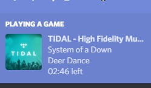
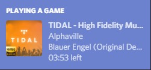
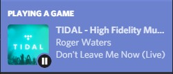
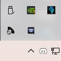
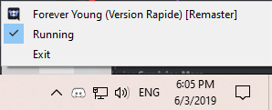

## TIDAL - Discord Rich Presence plug-in  (UNOFFICIAL)

Unofficial plug in to obtain Discord Rich Presence.

Feel free to report any bugs or make suggestions.

 

**If you like the project and want to buy me a glass of milk :)**

[Support me using paypal](https://www.paypal.me/KharonIX)
## Example Screenshot

When playing a song with master audio quality.

or you have paused playback

## Instructions
The new version doesn't require connection with last-fm, 'cause I reversed engineered TIDAL API,  get the data from the window name of the app.

1.  Download the latest release from [here](https://github.com/purpl3F0x/TIDAL-Discord-Rich-Presence-UNOFFICIAL/releases)
(windows and osx are supported).

2.  Run the binary, enjoy.

3.  *Optional*: Place the exe in windows start-up folder to start when computer starts. For OSX select that option from by right clicking the app on taskbar.

The program registers an icon on the taskbar, ~~where you can see the song playing and temporary disable *rich presence*~~.

 

P.S. Remember to make sure you have Game Activity enabled!

## Build Instructions

To build the executable you'll need either msvc on windows or clang on osx. For windows I had problems with gcc either conflicting with discord lib on (debug) and http not have <mutex>.

### Disclaimer: This project is Unofficial and it's not published from TIDAL.com.

Kudos to:
+ https://github.com/rares9301
for their awesome work.

> ### “I don’t like expending more effort than I have to.” -Ayanokouji Kiyotaka
