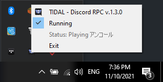

## TIDAL - Discord Rich Presence 

C++ code that simulates playing a game to show tidal rich presence that also uses api.tidal

Feel free to report any bugs or make suggestions.

 

**If you like the project and want to buy me a cup of coffee :D**

[Support me using paypal](https://www.paypal.me/KharonIX)
## Example Screenshot

Playing a song with hifi audio quality.

Playing a song with master audio quality.

Paused playback

## Instructions
No longer requires connection with last-fm, 'cause rev-engineered TIDAL API, by using the data from the window name of the app.

1.  Download the latest release from [here](https://github.com/rares9301/tidal_rich_presence_master/releases)
(windows and osx are supported).

2.  Run the binary.

3.  *Optional*: You can also place the exe in windows start-up folder to autorun it at start-up. (if you don't do it you ll have to manually start it every time you start your computer) For OSX select that option from by right clicking the app on taskbar.

The program registers an icon on the taskbar, where you can see the song playing and temporary disable *rich presence*.

P.S. Make sure you have Game Activity enabled!

## Build Instructions

To build the executable you'll need either msvc on windows or clang on osx. (gcc doesnt seem to work for some reason,idk why, ask discord.js that)

### Disclaimer: This project isnt't endorsed and it's not published by TIDAL.com.

Thanks to:
+ https://github.com/rares9301
+ my supporters :D - Anagnoste Mario & Valentin24
for their awesome work.

> ### “I don’t like expending more effort than I have to.” -Ayanokouji Kiyotaka
